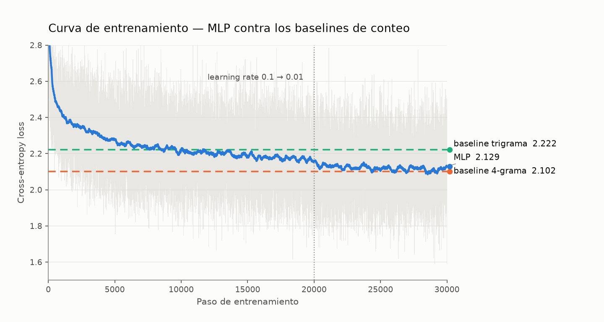
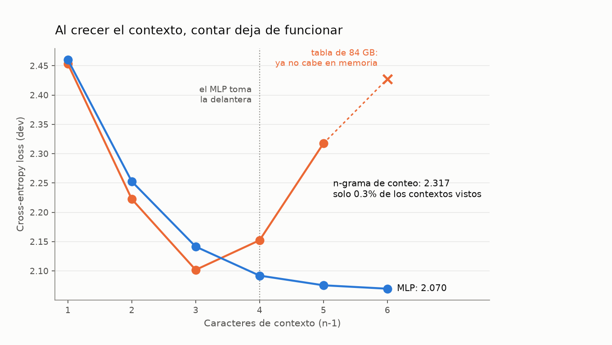
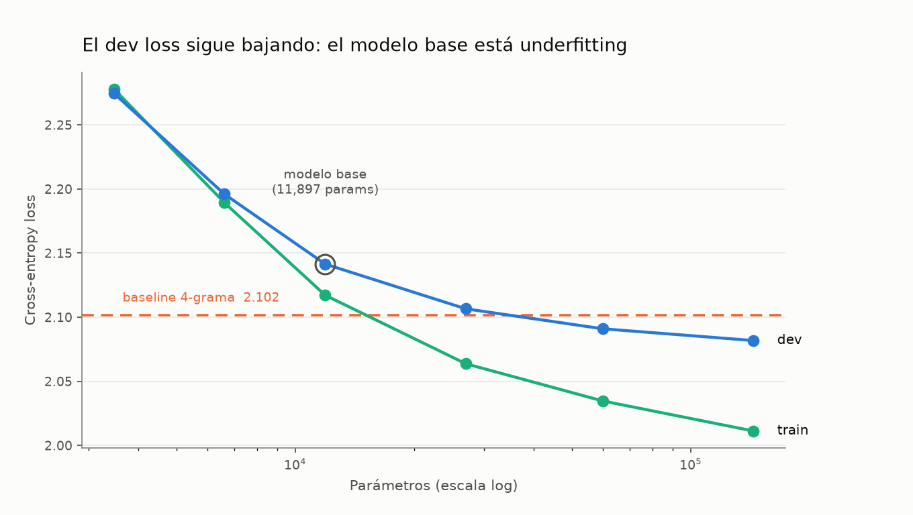
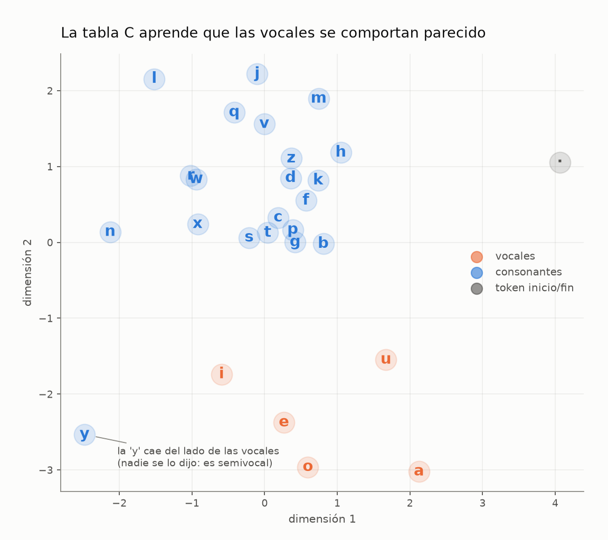

# 01 — A Neural Probabilistic Language Model (Bengio et al., 2003)

📄 Paper original: https://www.jmlr.org/papers/volume3/bengio03a/bengio03a.pdf

## La idea en simple

Antes de este paper, los modelos de lenguaje eran **n-gramas de conteo**: tablas gigantes
que guardaban, literalmente, cuántas veces viste "the cat sat" para estimar
P(sat | the cat). El problema: esas tablas crecen exponencialmente y no generalizan —
si nunca viste "the dog sat" pero sí "the cat sat", el modelo no tiene forma de saber
que "dog" y "cat" se comportan parecido.

Bengio et al. (2003) propusieron:

1. Representa cada palabra como un **vector denso aprendible** (embedding), no como un
   índice arbitrario.
2. Concatena los embeddings de las últimas N palabras de contexto.
3. Pasa eso por un **MLP** que predice la distribución de la siguiente palabra.

Como el modelo aprende que "cat" y "dog" tienen embeddings parecidos, generaliza:
aprender sobre "the cat sat" le ayuda con "the dog sat" aunque nunca la haya visto. Es el
ancestro directo de word2vec y, varios pasos después, de los Transformers.

## Qué reproduje

Una versión a **nivel de caracteres** sobre 32,033 nombres propios (enfoque pedagógico de
Karpathy, "makemore"). Misma arquitectura del paper: tabla de embeddings + MLP con una
capa oculta (tanh) + softmax, prediciendo el siguiente carácter dados 3 previos.

**Pero reproducir este paper no es entrenar el MLP.** El paper no afirma "los embeddings
funcionan" — afirma que **superan a los n-gramas de conteo suavizados** (~24% mejor
perplejidad, Tabla 1). Sin entrenar el rival no se prueba nada, así que aquí se entrenan
los dos sobre los mismos splits.

**Arquitectura:** contexto de 3 caracteres · |V|=27 (a-z + token ".") · embeddings de
10 dimensiones · capa oculta de 200 · **11,897 parámetros** (un GPT-2 pequeño tiene 124M).

## Resultados

RTX 4050, 30,000 pasos, ~1 minuto.

| Modelo | train | dev | **test** | perplejidad dev |
|---|---|---|---|---|
| Bigrama (1 char ctx) | 2.4542 | 2.4531 | 2.4580 | 11.62 |
| Trigrama (2 char ctx) | 2.1874 | 2.2225 | 2.2240 | 9.23 |
| **4-grama (3 char ctx)** | 1.9187 | **2.1018** | **2.1044** | **8.18** |
| **MLP (11,897 params)** | 2.1171 | 2.1414 | 2.1431 | 8.51 |

**Con la configuración base, el MLP pierde contra el 4-grama por 1.9%.**

Y eso es el resultado correcto, no un bug. La "maldición de la dimensionalidad" que el
paper resuelve **no existe con |V|=27**: hay 27³ = 19,683 contextos posibles contra
182,625 ejemplos de entrenamiento, así que el 27.6% de los contextos ya se vio y los
conteos son densos. El paper necesitaba |V|=17,000 (≈5×10¹² contextos) para que la
dispersión hundiera al n-grama.

El mecanismo del paper sí se asoma en el gap train/dev: **+0.183 para el 4-grama**
(memoriza) contra **+0.024 para el MLP** (generaliza). El MLP generaliza mucho mejor;
solo le falta capacidad para cobrarlo.



### Dónde sí gana la red neuronal

Creciendo el contexto sobre los mismos nombres aparece la dispersión y el resultado se
invierte:

| ctx | contextos vistos / posibles | N-grama dev | MLP dev |
|---|---|---|---|
| 1 | 27 / 27 (100%) | **2.4531** | 2.4602 |
| 2 | 595 / 729 (81.6%) | **2.2225** | 2.2527 |
| 3 | 5,438 / 19,683 (27.6%) | **2.1018** | 2.1414 |
| 4 | 20,243 / 531,441 (3.8%) | 2.1522 | **2.0919** |
| 5 | 36,544 / 14,348,907 (0.3%) | 2.3175 | **2.0754** |
| 6 | tabla de 84 GB | *no cabe en memoria* | **2.0696** |

El n-grama toca fondo en ctx=3 y luego **empeora**: su cobertura de contextos se desploma
de 27.6% a 0.3%, así que cada vez más predicciones caen en contextos nunca vistos y el
suavizado tiene que inventar la respuesta. El MLP mejora monotónicamente y le gana desde
ctx=4. En ctx=6 la tabla de conteo pediría 27⁷ ≈ 10,460 millones de celdas — **84 GB** —
mientras el MLP solo crece 2,000 parámetros por carácter extra: exponencial contra lineal.
Ésa es la tesis del paper.



Tres comparaciones distintas, para no exagerar el resultado:

| Comparación | Resultado |
|---|---|
| A contexto igual (3) | el MLP **pierde** 1.9% |
| A contexto igual (5) | el MLP **gana** 10.4% |
| Mejor MLP (ctx=6) vs mejor n-grama (ctx=3) | el MLP **gana** 1.5% |

### El modelo base está underfitting

Un gap train/dev chico se lee fácil como "no hay overfitting", pero la lectura útil es
otra: el dev loss **sigue bajando** al crecer el modelo, así que falta capacidad.

| m / h | params | train | dev | gap |
|---|---|---|---|---|
| 2 / 100 | 3,481 | 2.2778 | 2.2745 | −0.003 |
| **10 / 200 (base)** | 11,897 | 2.1171 | 2.1414 | +0.024 |
| 30 / 500 | 59,837 | 2.0347 | 2.0909 | +0.056 |
| 50 / 800 | 143,777 | 2.0112 | **2.0818** | +0.071 |

Con 143,777 parámetros el MLP supera al 4-grama sin tocar el contexto. El modelo base
tenía dos limitaciones a la vez: contexto **y** capacidad.



### Qué aprendió la tabla C

Entrenando con embeddings de 2 dimensiones se pueden graficar directamente, sin PCA ni
t-SNE de por medio. Nadie le dijo al modelo qué es una vocal — solo vio secuencias de
caracteres — y aun así `a e i o u` quedan agrupadas y separadas de las consonantes. La
`y` cae del lado de las vocales, que es exactamente lo que uno esperaría de una semivocal.



Esto es el mecanismo del paper hecho imagen: los caracteres que se *comportan* parecido
terminan *cerca*, y de ahí sale la generalización.

### Nombres generados

`krita, rapon, dagar, mairishaiyah, branivi, breigh, margemin, wyson, mausincelos,
sarmin, vies, kadcy, makeell`

13 de 20 muestras no aparecen en `names.txt`. **Ojo con esta métrica:** que un nombre
generado no esté en el dataset es evidencia débil de "creatividad", y que sí esté no es
evidencia de memorización — con nombres de 3-4 caracteres hay pocas combinaciones
plausibles, así que el modelo reconstruye `don` o `mar` por estadística pura. Es un
complemento cualitativo al loss, no una métrica.

## Cómo correrlo

```bash
python -m venv .venv --system-site-packages
.venv/Scripts/activate          # Windows; en Linux/Mac: source .venv/bin/activate
pip install torch matplotlib "numpy<2"

python train.py            # corrida canónica      -> loss_curve.png, results.json
python analysis.py         # los tres experimentos -> contexto.png, capacidad.png, embeddings.png
python analysis.py replot  # re-dibuja las figuras desde analysis.json, sin reentrenar
```

Detecta CUDA automáticamente. `train.py` tarda ~1 min en GPU; `analysis.py` ~10 min
(entrena 13 modelos). Las dos corridas que hice dieron números idénticos hasta el cuarto
decimal — todo está seeded.

> `numpy<2` es necesario: torch 2.3.x fue compilado contra NumPy 1.x y con NumPy 2
> falla toda conversión torch↔numpy.

## Archivos

| Archivo | Qué es |
|---|---|
| `01_bengio_2003.ipynb` | El recorrido explicado paso a paso — empieza aquí |
| `train.py` | Corrida canónica: MLP + baselines + evaluación + curva |
| `analysis.py` | Los tres experimentos (contexto, capacidad, embeddings) |
| `viz.py` | Paleta y estilo compartidos |
| `results.json` / `analysis.json` | Métricas generadas por los scripts |

## Conclusión

El mecanismo del paper funciona, pero **solo cuando el problema lo necesita**. A |V|=27 y
contexto corto, contar sigue siendo mejor: la red paga el costo de aprender una
representación sin cobrar el beneficio. En cuanto el espacio de contextos crece más allá
de lo contable, la ventaja se invierte y no vuelve atrás.

Reproducir el paper no era entrenar el MLP. Era encontrar el punto donde deja de ser
opcional.

## Siguiente paso

Subir a **nivel de palabras** sobre un corpus real (Brown, WikiText-2) — ahí |V| pasa de
27 a ~17,000 y la dispersión existe desde el primer n-grama, que es el régimen donde el
paper hizo su afirmación original.
